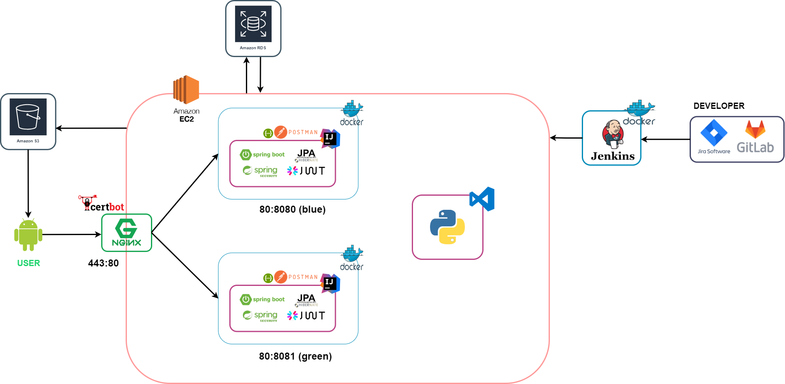
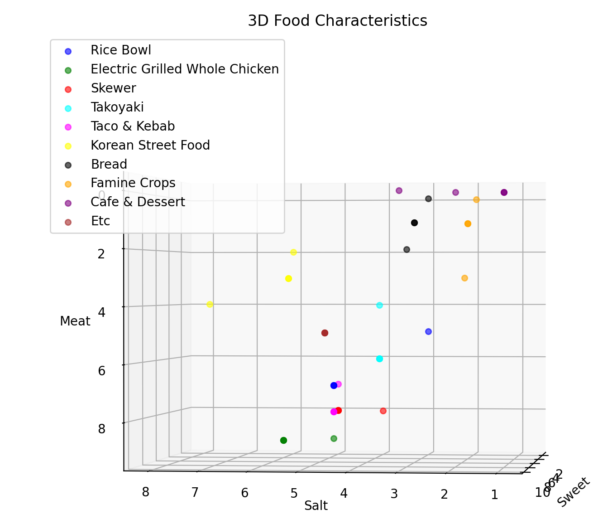
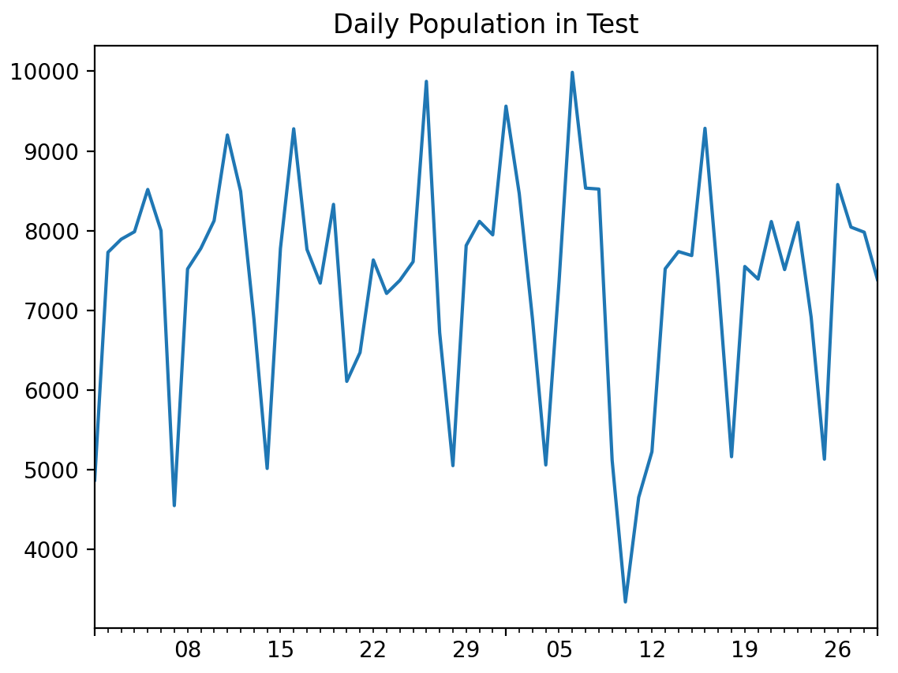
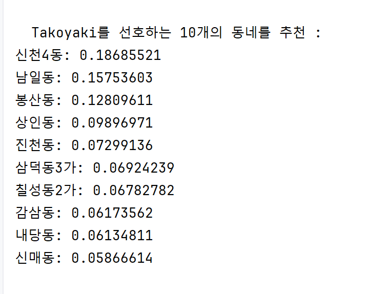
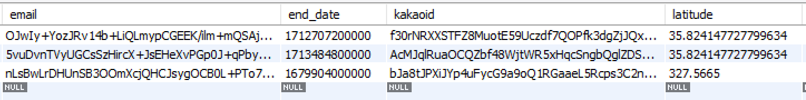
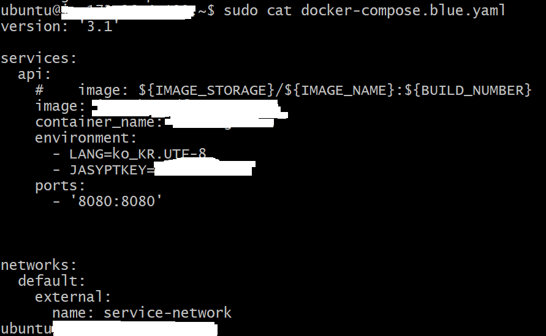
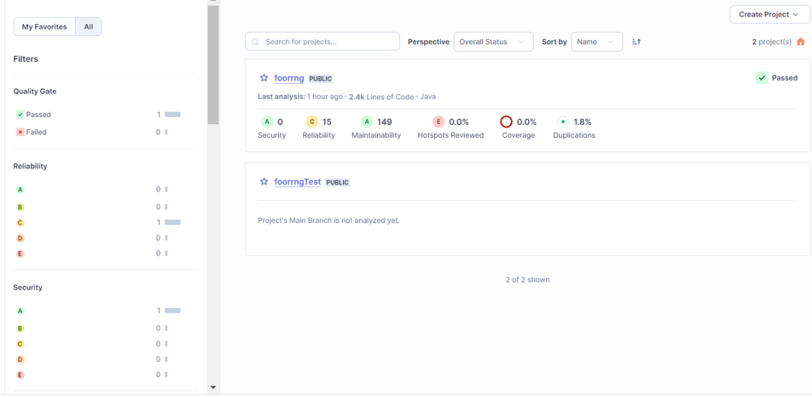
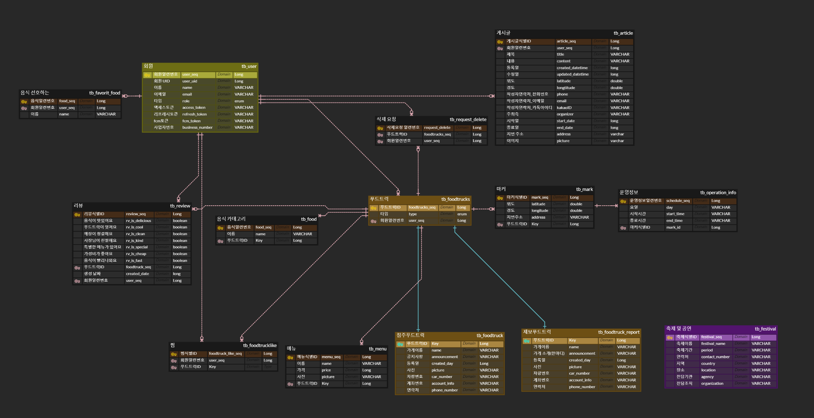

# 👋 푸르릉 👋
### 빅데이터를 활용한 위치 추천 서비스를 제공하는 앱

<br>

### 💚 푸르릉 소개 및 시연 영상

<br>

### 💚 푸르릉 서비스 화면

<br>

### 💚 주요 기능
- 서비스 설명 : 빅데이터를 활용하여, 유동 인구와 특정 음식을 선호하는 소비자가 많은 위치를 추천하는 서비스
- 주요 기능
  - 점주
    - 푸드트럭 등록, 푸드트럭 정보 조회 및 수정 가능. 해당 푸드트럭의 리뷰 조회.
    - 장사할 위치 선정 및 운영 관리 기능 제공
    - 푸드트럭을 이용할 잠재적 소비자가 많이 위치한 장소를 동단위로 추천
    - 축제 정보 및 푸드트럭 모집 공고글을 조회
  - 소비자
    - 오늘 선호하는 음식을 선택 -> 빅데이터에 활용
    - 푸드트럭 정보 조회 가능, 원하는 푸드트럭 찜, 이용한 푸드트럭 리뷰 작성 가능
    - 푸드트럭 제보 가능
    - 제보된 푸드트럭 잘못된 정보 수정 및 삭제 가능
    - 푸드트럭 모집 공고글을 작성할 수 있음

<br>

### 💚 개발 환경 
🌱 백앤드
- intellij
- spring boot 3.2.1
- spring-boot-jpa
- spring security 6.1.3
- java 17
- MySQL 8.0.36
- queryDSL 5.0.0

🌱 프론트   
  ...

🌱 외부 API
- kakao 회원가입/로그인 API
- 사업자번호 조회 API

🌱 Infra
- Docker
- Jenkins 2.426.2
- Nginx 1.24.0
- AWS EC2
- AWS S3 
- RDS 
- Server 20.04.6 LTS (GNU/Linux 5.15.0-1051-aws x86_64)

<br>

### 💫서비스 아키텍처 


<br>

### 💫CICD
[포팅 메뉴얼](https://www.notion.so/eb6332f528224bf39de4dca7baed45d1?pvs=4)

<br>

### 🎨 EC2 포트 정리 
| To | Action | From |
| :-----: | :-----: | :-----: |
| 22 | ALLOW | Anywhere |
| 8989 | ALLOW | Anywhere |
| 443 | ALLOW | Anywhere |
| 8080/tcp | ALLOW | Anywhere |
| 8081 | ALLOW | Anywhere |
| 80 | ALLOW | Anywhere |
| 9090 | ALLOW | Anywhere |
| 5000 | ALLOW | Anywhere |
| 50000 | ALLOW | Anywhere |

<br>

## 💥기술 특이점

### 💥 빅데이터
> 


**🍲 KNN 음식 분류화** <br>
 <br>
비슷한 음식끼리 같은 음식으로 분류하여 동네에 A를 선호하는 소비자에게 A와 유사한 A,B,C를 판매하는 점주에게 해당 지역에 대한 추천 가산값 부여

**📊 시계열 분석을 활용한 다음날 인구 유동 예측** <br>

2024.01~2024.03 대구 대중교통 승하차 정보를 바탕으로 다음 날 인구 수 예측

**🧩 앙상블의 특성 이용** <br>
 <br>
서로 상이한 모형들의 예측, 분류 결과를 종합하여 최종적인 의사결정 진행


### 💥 보안성
> 
<br>

**🔒 CBC 암호화** <br>
 <br>
같은 값이라도 다르게 저장하며 양방향의 특성으로 유저에게 복호화 후 프론트에 전달

**🗝️ yml 암호화** <br>
 <br>
jasypt를 활용하여 yml을 보안 조치하였고, 환경변수는 Docker-Compose, yml파일은 jenkins Credential에 저장

**🔍 SonaQube 정적 코드 분석** <br>
 <br>
정적 코드 분석을 통해 보안 위협, codeSmell, 기술 부채 등을 확인하고 신속 조치


<br>

### 👨‍👩‍👧 협업툴
- Git
- Jira
- Notion
- Mattermost

<br>

### 📝 요구사항 정의서
[요구 사항 정의서](https://www.notion.so/5cbcdd7abaaa4695873151918a86e416?pvs=4)

<br>

### 🎨 ERD


<br>

### ⚡️ Git 컨벤션
⚡️제목
- Feat : 새로운 기능을 추가하는 경우
- Fix : 버그를 고치는 경우
- Docs : 문서를 수정한 경우
- Style : 코드 포맷 변경, 세미콜론 누락, 코드 수정이 없는 경우
- Refactor : 코드 리펙토링
- Test : 테스트 코드. 리팩토링 테스트 코드를 추가했을 때
- Chore : 빌드 업무 수정, 패키지 매니저 수정
- Design : CSS 등 사용자가 UI 디자인을 변경했을 때
- Rename : 파일명(or 폴더명)을 수정한 경우
- Remove : 코드의 삭제가 있을때

<br>

⚡️commit message 예시
```
Feat : "추가 로그인 함수"
```

<br>


### ⚡️ Git Flow
- Git flow 사용한 브랜치
  - master
  - develop be/ad : 배포
  - sprint{N} : 스프린트 주차별 브랜치
  - feature : 세부 작업 브랜치

<br>

- git flow 기획한 이유
  - 개발 시, 맡은 기능 별로 develop 하위에 feature 브랜치 생성
  - 개발 완료 시, 해당 feature 브랜치를 develop에 merge한다.
  - 개발 테스트 시, develop에 파이프라인 연결하여 배포 및 테스트 작업 진행
  - 개발 완료 및 테스트 완료 시, master 브랜치로 배포 진행

<br>

- Git 브랜치 이름 컨벤션
  ```
  // Back-end
  feature/도메인/세부기능

  // Front-end
  ....
  ```

<br>

### 🐛 코드 컨벤션
🐛 프론트 코드 컨밴션    
...

<br>

🐛 백앤드 코드 컨밴션
- JPQL vs **QueryDSL**
```
// File 구조

Domain
    Entity
    Repository
    RepositoryCustom
    RepositoryImpl
    Controller
    Service
    ServiceImpl
    RequestDto
    ResponseDto
```


<br>

### 👨‍👩‍👧 Jira
협업 및 일정, 업무 관리를 위해 Jira를 이용하였습니다. 매주 월요일 오전 회의를 통해 한 주 동안 진행할 스프린트를 계획하고, 진행할 스토리와 테스트를 해당 스프린트에 생성하여 등록하였습니다. 또한 매주 금요일 오후에 회의를 진행하여 해당 스프린트에 대한 회고를 진행하였습니다.
- Epic : 큰 도메인으로 분류
- Stroy : 사용자 관점에서 기능을 사용하는 상황을 기술
- subtask : 사용자가 사용할 기능을 개발할때 필요한 목록으로 디테일하게 기술, 소요된 시간 및 스토리포인트 할당

<br>

### 👨‍👩‍👧 Notion
개발 환경 구축에 필요한 정보, 라이브러리 및 기술 관련 링크, 회의록 작성 및 프로젝트 진행에 관련된 산출물을 기록하고 공유하는 용도로 사용하였습니다. 컨벤션 및 브랜치 전략 등 또한 노션에 기록함으로써, 모두가 항시 확인할 수 있도록 관리하였습니다.

<br>

### 👨‍👩‍👧 Scrum
매일 아침 9시에 스크럼 회의를 10분 동안 진행하며, 어제 했던 일과 오늘 진행할 업무, 발생한 이슈를 공유하는 시간을 가졌습니다. 스크럼을 통해 팀원들의 현재 상황을 파악할 수 있고, 프로젝트에 대해 꾸준히 모니터링할 수 있었습니다.


<br>

### 👨‍👩‍👧 팀원 역할
😃정철주

😊김건우

😘박정환
- Jenkins 와 Docker 활용한 AWS EC2 서버 프로젝트 CI/CD 구성
- NGINX 를 통한 무중단배포
- ERD & DB
- Spring Boot, Jpa, queryDSL 을 활용한 백엔드 API 작업
- 빅데이터 / DB / 백엔드 서버간 연결 및 자동업데이트
- Spring Security, Jwt 를 활용한 인증 / 인가 적용

😝이지연
- ERD 설계 및 DB 구축
- queryDSL 사용하여 rest API 작업
- 빅데이터 데이터 수집 및 전처리 작업
- 그외 발표자료 작성, 지라 관리, 등 필요한 업무 지원

😛김인호
- 빅데이터 기술 KNN, 시계열, 앙상블 기법 적용
- CBC 암호화 기법을 이용한 민감정보 암호화 
- 보안 키 서버에 분할 저장하여 보안 분산화 
- 소나큐브를 활용하여 정적 분석 후 피드백 제공
- 도메인 ssl 인증연결 
- Spring Boot, Jpa를 이용한 API 기능 개발

😀조수현
- ERD 바탕으로 DB 설계
- 빅데이터 데이터 수집 및 전처리 작업
- API 명세서 바탕으로 API 구축
- UCC 영상 기획, 촬영, 편집

<br>

### 👨‍👩‍👧 프로젝트 소감
😃정철주

😊김건우

😘박정환

😝이지연

😛김인호

😀조수현
